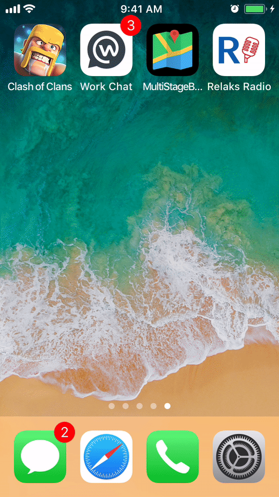

# MultiStageBottomSheet

========================

##Language
Swift 4.0.3

##Tools
Xcode 9.0, Cocoa Touch,

##About The Library
Sample UI like iOS native map application. 

## Contributing

Forks, patches and other feedback are welcome.

## Creator

[Muzahidul Islam](http://mmsaddam.github.io/) 

